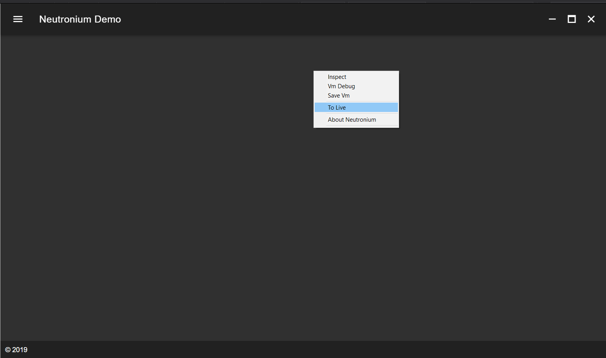
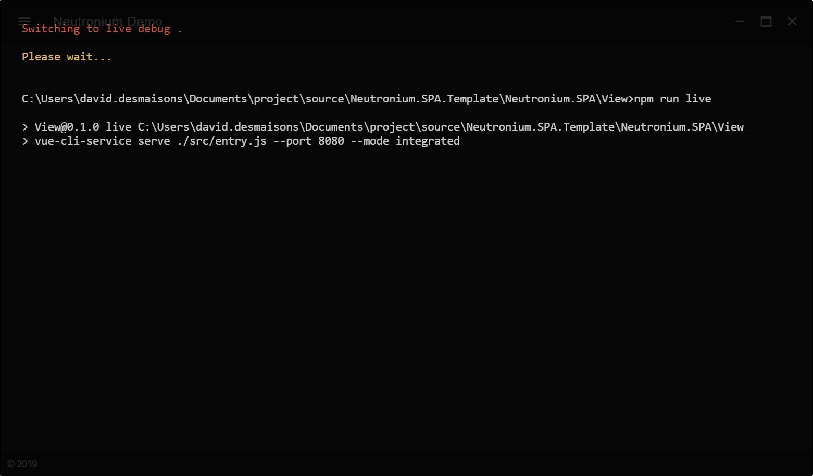
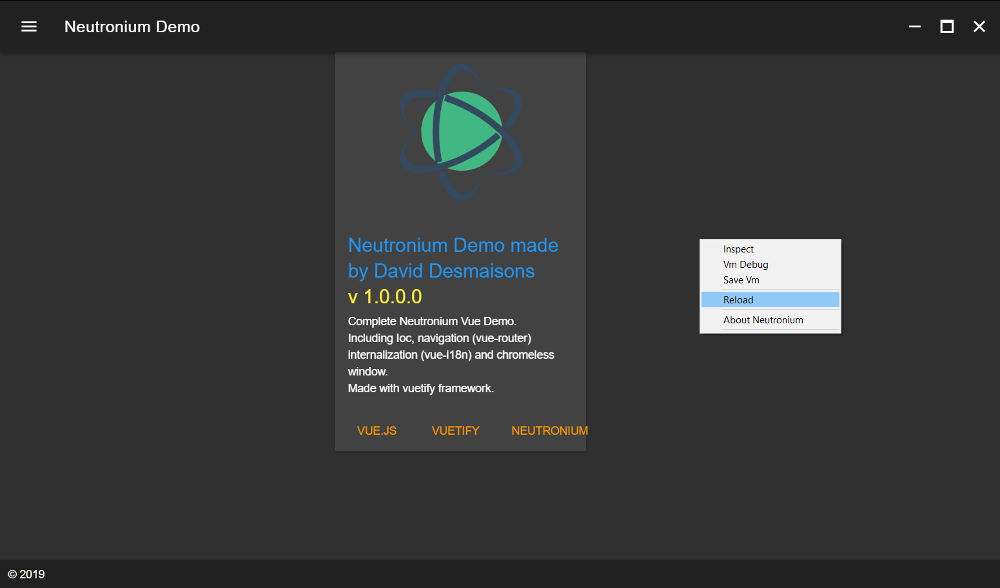

<h1 align="center">Neutronium.SPA.Template</h1>

## Description

This project is a template application for Neutronium Vue project. 
It is built on the top of [Vuetifyjs](https://vuetifyjs.com) material component framework. 
See [Neutronium.SPA.Demo](https://github.com/NeutroniumCore/Neutronium.SPA.Demo) as reference application built with this template.

## Features

### npm script

* `npm run serve`

    Serve files for Neutronium for debug in local browser using `.cjson` files as view-model.

* `npm run live`

    Serve files for Neutronium hot-reload.

* `npm run build`

    Build files to be used in Neutronium application.

### Command line argument

        Usage:
            --mode=live
            -m=dev --url=http://localhost:9090/index.html
            -u=http://localhost:9091/index.html

        Options:
            -m --mode=(live|dev|prod)    Set application mode.
            -u --url=<uri>   Set view url

### Application mode

* Live:

        Debug mode with hot-reload activated using file served by `npm run live` scripts.

* Dev:

        Debug mode using local files.

* Prod:

        No debug, using local files.

Note: when running in live mode, it is not needed to run manually `npm run live` this will be called automatically by the application.

### Injected context command

#### To Live

* Only available in `dev` mode.
* Switch to `live` mode by running `npm run live` and reloading the page using the served files.

#### Reload

* Only available in `live` mode.
* Reload the page. Maybe useful on some scenario when page does not automatically reload.

### Routing

Neutronium.SPA.Demo illustrates how to integrate with [vue-router](https://router.vuejs.org/en/). 
See more details [here](./Documentation/Routing.md)

### Internalization

Integration with [vue-i18n](https://kazupon.github.io/vue-i18n/en/) is provided. 
See more details [here](./Documentation/Internalization.md)

### Chromeless Window

See more details [here](./Documentation/Chromeless.md)

## Developing 

See more details [here](./Documentation/Developing.md)

## Built with

