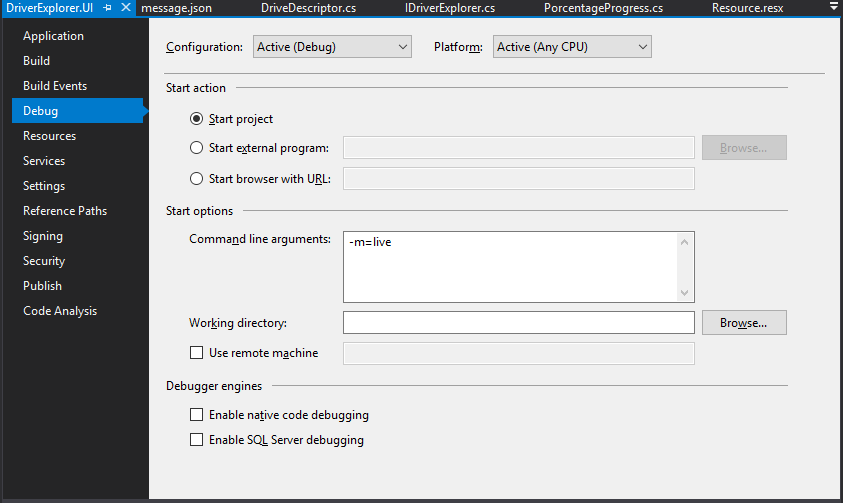
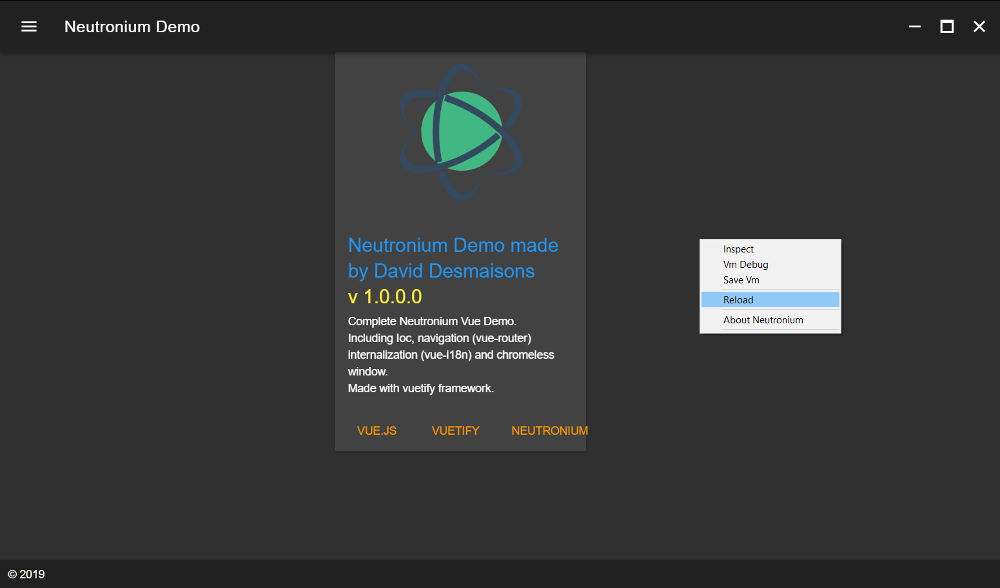

# Developing

Neutronium.SPA.Demo is based on [neutronium vue plugin](https://github.com/NeutroniumCore/vue-cli-plugin-neutronium).

So you need to run `npm install` first time.

``` bash
# install dependencies
npm install
```

### Installed npm script

Neutronium vue plugin installs 3 scripts by default:

* `npm run serve`

    Serve files for Neutronium for debug in local browser using `.cjson` files as viewModel.

* `npm run live`

    Serve files for Neutronium hot-reload.

* `npm run build`

    Build files to be used in Neutronium application.

## Develop in the browser

To open the view in the browser:

``` bash
# serve with hot reload at localhost:9000
npm run serve
```

To open the page at a specific route, use the `-- --open-page=#\my-page` option:


``` bash
# serve with hot reload at localhost:9000 starting with page about
npm run serve -- --open-page=#/about
```


ViewModels:<br>
During development `vm.cjson` files are loaded as substitute viewModels.<br> By convention the viewModel corresponding to a page will be loaded from a folder with the same route name under the data folder.<br>
As such the folder structure is the following:


``` bash
├── data
│   ├── about
│   │   └── vm.cjson
│   └── main
│       └── vm.cjson
```

Regular JSON files are compatible with `.cjson` format, but the best way to generate `.cjson` files is to can use the `save Vm` button of Neutronium debug toolbar to save copy of "real" ViewModel.


## Develop with hot-reload

This allow to edit HTML, CSS and javascript while working in a running Neutronium application and see changes live.

#### Starting
Alternatively:
  * Run application in `live mode`

  


  * Switch to `live mode`  by running `npm run live` and reloading the page using the served files.


#### Reload

Sometimes it is necessary to force browser reload while using hot-reload. This possible using `reload` command.

* Reload the page. Maybe useful on some scenario when page does not automatically reload.




## Build

To build the files for usage in Neutronium application, just run:
``` bash
# build files for usage in the C# application
npm run build
```


