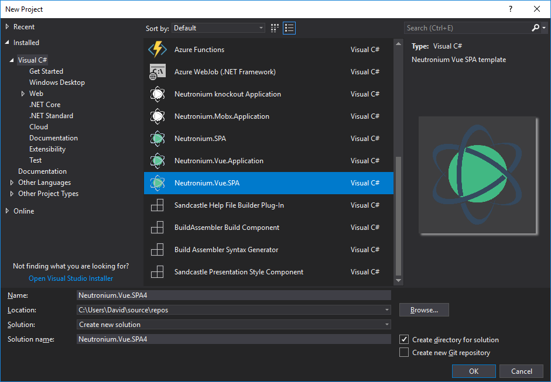

# Installation


## From Visual studio marketplace
This project is available as a Visual studio project template.

Download it from [visual studio marketplace](https://marketplace.visualstudio.com/items?itemName=DavidDes.NeutroniumApplicationTemplate)

Then in Visual Studio:
File => New => Project => Neutronium.Vue.SPA

  


## After creating the project

For C#:

```
nuget restore
```

For javascript:

```
cd View
npm install
```