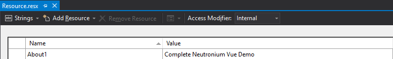

# Internalization

## Using internalization

 [`vue-i18n`](https://kazupon.github.io/vue-i18n/) is used as a library to internalize messages.

Resource.resx file is used on the C# side and transformed by [message.tt](https://github.com/NeutroniumCore/Neutronium.SPA.Template/blob/master/Neutronium.SPA/View/src/message.tt) into a `.json` file that is used by `vue-i18n` as resource.<br>

For example, to reference `About1` key defined as below:
<br>

Just do:

```HTML
<v-list-tile-title v-text="$t('Resource.About1')"></v-list-tile-title>
```

## Build

After changing resources, you had to 
* Rebuild the solution
* Execute "Run Custom Tool" in order to regenerate `message.json`<br/>
<br>